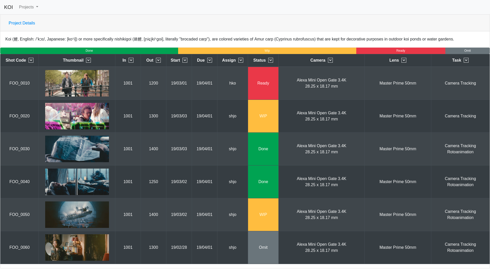

# koi
Simple Project Management Web Application

## Language

1. HTML

1. CSS

1. JavaScript

1. [Go](https://golang.org/)

1. [MongoDB](https://www.mongodb.com/)

## UI

[Preview Demo : https://lazypic.github.io/koi](https://lazypic.github.io/koi/)

- Example Images from [Tears of Steel](https://media.xiph.org/tearsofsteel/)

## 웹 애플리케이션 튜토리얼

1. HTML
    - [WEB1 - HTML & Internet | 생활코딩](https://opentutorials.org/course/3084) | [Youtube 자동재생](https://www.youtube.com/playlist?list=PLuHgQVnccGMDZP7FJ_ZsUrdCGH68ppvPb)
    - [HTML - Build a Website | Tutorial](https://www.youtube.com/playlist?list=PLLAZ4kZ9dFpMSXUYwxDFOvyxlssug29Fu)

1. CSS
    - [WEB2 - CSS | 생활코딩](https://opentutorials.org/course/3086) | [Youtube 자동재생](https://www.youtube.com/playlist?list=PLuHgQVnccGMAnWgUYiAW2cTzSBywFO75B)
    - [CSS - Style Your Website | Tutorial](https://www.youtube.com/playlist?list=PLLAZ4kZ9dFpNO7ScZFr-WTmtcBY3AN1M7)
    - [Bootstrap](https://getbootstrap.com/)

1. JavaScript
    - [WEB2 - JavaScript | 생활코딩](https://opentutorials.org/course/3085) | [Youtube 자동재생](https://www.youtube.com/playlist?list=PLuHgQVnccGMBB348PWRN0fREzYcYgFybf)
    - [Javascript - Programming Language | Tutorial](https://www.youtube.com/playlist?list=PLLAZ4kZ9dFpPQbcrA-SzALJeFm23tPrAI)

1. PHP
    - [WEB2 - PHP | 생활코딩](https://opentutorials.org/course/3130) | [Youtube 자동재생](https://www.youtube.com/playlist?list=PLuHgQVnccGMAMMNByX8Bf1BkVrShBhj1I)

1. MySQL
    - [DATABASE2 - MySQL | 생활코딩](https://opentutorials.org/course/3161) | [Youtube 자동재생](https://www.youtube.com/playlist?list=PLuHgQVnccGMCgrP_9HL3dAcvdt8qOZxjW)

1. PHP & MySQL
    - [WEB3 - PHP & MySQL | 생활코딩](https://opentutorials.org/course/3167) | [Youtube 자동재생](https://www.youtube.com/playlist?list=PLuHgQVnccGMA5836CvWfieEQy0T0ov6Jh)

## Golang 튜토리얼

[Introduction to the Go Programming Language](https://pythonprogramming.net/go/introduction-go-language-programming-tutorial/)

## Golang MongoDB Tutorial

[MongoDB programming in Go (golang) - Part 1](https://www.youtube.com/watch?v=WjbeukMQP2E&list=PL0aDKsruoiW2jac2D2flxZofQLfEOc2GU&index=20)
[MongoDB programming in Go (golang) - Part 2](https://www.youtube.com/watch?v=3feOIdbq2LQ&list=PL0aDKsruoiW2jac2D2flxZofQLfEOc2GU&index=22)
